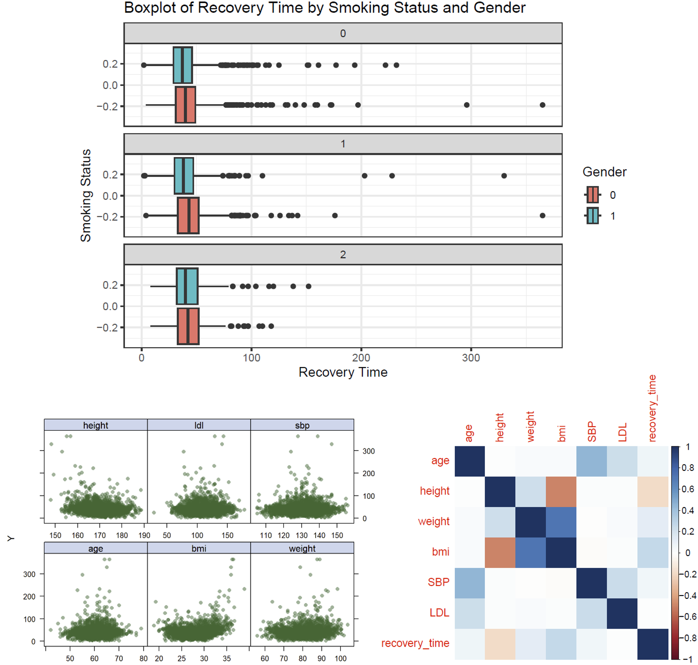

```{r message=FALSE, warning = FALSE, echo=FALSE}
library(tidyverse)
library(corrplot)
library(ggridges)
library(corrplot)
library(rsample)
library(lattice)
library(caret)
library(pls)
library(patchwork)

load("recovery.Rdata")
covid = as_tibble(dat) |>
  na.omit() |>
  janitor::clean_names() |>
  mutate(gender = factor(gender), 
         hypertension = factor(hypertension), 
         diabetes = factor(diabetes), 
         vaccine = factor(vaccine), 
         severity = factor(severity), 
         race = factor(race), 
         smoking = factor(smoking)) |>
  select(- id) |>
  relocate(recovery_time)

set.seed(11)
covid_split = initial_split(covid, prop = 0.8)
training = training(covid_split)
testing = testing(covid_split)
xtrain = model.matrix(recovery_time ~ ., training)[,-1]
ytrain = training$recovery_time
xtest = model.matrix(recovery_time ~ ., testing)[,-1]
ytest = testing$recovery_time

# showing connection between the response and other variables
theme1 = trellis.par.get()
theme1$plot.symbol$col = rgb(.2, .4, .2, .5)
theme1$plot.symbol$pch = 16
theme1$plot.line$col = rgb(.8, .1, .1, 1)
theme1$plot.line$lwd = 2
theme1$strip.background$col = rgb(.0, .2, .6, .2)
trellis.par.set(theme1)
```

# Exploratory Analysis and Data Visualization

## Variable Types

In this dataset, `age`, `height`, `weight`, `bmi`, `sbp`, `ldl`, and `recovery_time` are continuous variables, while `gender`, `hypertension`, `diabetes`, `vaccine`, `severity`, `race`, and `smoking` are categorical variables.

## Data Visualization

The **boxplot of recovery time by smoking status and gender** reveals a notable trend: across all smoking statuses, females (`gender` = 0) consistently exhibit longer recovery times compared to males. Interestingly, individuals who had never smoked had more outliers on the right side of the boxplot, suggesting a longer recovery time. This counter-intuitive finding suggests that individuals with healthier lifestyles, such as non-smokers, paradoxically require more time to recover from COVID-19.

We then created **scatterplots of six variables against recovery time**. It is evident that most recovery times fall within the range of 0-100 days. However, no clear linear relationship emerges between recovery time and any of the variables.

Moreover, the **correlation analysis** conducted on variables including "height," "weight," and "bmi" suggests a strong positive correlation among these attributes, which aligns with our common understanding. However, no significant correlations were observed between these attributes and other variables in the dataset.

::: {style="text-align: center;"}

:::

# Model Training

## Lasso

The **model assumptions** for Lasso includes:

-   Sparsity Assumption: Lasso assumes that the true model depends on only a small number of predictors, implying that the model is sparse. This means it's suited for scenarios where only a few variables significantly impact the response variable.

-   Regularization: By penalizing the magnitude of the coefficients (L1 penalty), Lasso encourages smaller absolute values of coefficients, thus reducing model complexity and the risk of overfitting.

The attached graphs display the Root Mean Square Error (RMSE) across different values of the regularization parameter $\lambda$. The second graph adheres to the "1se rule."

```{r echo=FALSE, warning = FALSE, message=FALSE}
set.seed(11)

ctrl = trainControl(method = 'cv', number = 10)
ctrl_1se = trainControl(method = 'cv', number = 10, selectionFunction =  'oneSE')

lasso.fit = train(recovery_time ~ ., data = training, 
             method = 'glmnet', 
             tuneGrid = expand.grid(alpha = 1, 
                                    lambda = exp(seq(-5, -2, length = 100))), 
             trControl = ctrl)

plot(lasso.fit, xTrans = log)
```

```{r echo=FALSE, warning = FALSE, message=FALSE}
# applying 1se rule
lasso.fit.1se = train(recovery_time ~ ., data = training, 
             method = 'glmnet', 
             tuneGrid = expand.grid(alpha = 1, 
                                    lambda = exp(seq(-5, -2, length = 100))), 
             trControl = ctrl_1se)

plot(lasso.fit.1se, xTrans = log)
```

## Elastic Net

Model assumptions:\
(a) Combined Regularization: Elastic Net uses both L1 and L2 regularization, combining Lasso's variable selection capability with Ridge regression's ability to handle highly correlated predictors.\
(b) Adjusting Regularization Balance: Elastic Net has two regularization parameters, controlling the overall strength of regularization and the weight balance between L1 and L2 terms. This offers more flexible model tuning capability.\

```{r echo=FALSE}
ctrl = trainControl(method = 'cv', number = 10)
ctrl_1se = trainControl(method = 'cv', number = 10, selectionFunction =  'oneSE')

enet.fit = train(recovery_time ~ ., data = training, 
             method = 'glmnet', 
             tuneGrid = expand.grid(alpha = seq(0, 1, length = 21), 
                                    lambda = exp(seq(-8, 0, length = 100))), 
             trControl = ctrl)

myCol = rainbow(25)
myPar = list(superpose.symbol = list(col = myCol), superpose.line = list(col = myCol))

plot(enet.fit, par.settings = myPar, xTrans = log)
```


```{r echo=FALSE}
# applying 1se rule
enet.fit.1se = train(recovery_time ~ ., data = training, 
             method = 'glmnet', 
             tuneGrid = expand.grid(alpha = seq(0, 1, length = 21), 
                                    lambda = exp(seq(-8, 0, length = 100))), 
             trControl = ctrl_1se)

plot(enet.fit.1se, par.settings = myPar, xTrans = log)
```

## PLS

Model assumptions:\
(a) Linear Relationship: PLS assumes a linear relationship between the independent variables and the response variable. It aims to find the multidimensional direction in the X space that explains the maximum multidimensional variance direction in the Y space.\
(b) PLS assumes that the structure of the relationship between X and Y variables can be captured through a few latent structures. This is fundamental to reducing dimension and extracting the most relevant information from X that predicts Y.\

```{r echo=FALSE}
pls = plsr(recovery_time ~ ., data = training, scale = TRUE, validation = 'CV')
validationplot(pls, val.type = 'MSEP', legendpos = 'topright')
```

## MARS

Model assumptions:\
(a) Non-linearity and Interaction: MARS does not assume that relationships between the independent variables and the dependent variable are linear or follow a specific functional form. Instead, it adaptively fits piecewise linear regressions that can model complex non-linear relationships and interactions among variables.\
(b) Distribution of Errors: MARS does not make specific assumptions about the distribution of error terms.\

```{r echo=FALSE, message = FALSE, warning = FALSE}
mars_grid = expand.grid(degree = 1:6, nprune = 2:15)
ctrl = trainControl(method = 'cv', number = 10)

mars.fit = train(xtrain, ytrain, 
                 method = "earth", 
                 tuneGrid = mars_grid, 
                 trControl = ctrl)

ggplot(mars.fit) +
  theme_bw()
```

## GAM

Model assumptions:\
(a) Additivity: The effect of each predictor on the response is additive. The total effect on the response variable is the sum of the effects of each predictor, modeled by its own smooth function.\
(b) Smoothness of the Predictor Functions: The relationships between the predictors and the response can be adequately modeled using smooth functions. The degree of smoothness is usually determined by the data and is controlled by smoothing parameters, which can be estimated from the data itself.\

```{r echo=FALSE, message = FALSE, warning = FALSE}
gam.fit = train(xtrain, ytrain, 
                method = "gam", 
                trControl = ctrl)

par(mar = c(4, 2, 1, 1), mfrow = c(2, 3))
plot(gam.fit$finalModel)
```

## Random Forest

Model assumptions:\
(a) Independence among trees: Individual trees are built independently and they do not rely on each other when being created. The independence is crucial for reducing the correlation among trees, thus enhancing the model's ability to generalize.\
(b) Random Forest assumes that combining the predictions of multiple trees reduces error. This aggregation assumes that errors in individual trees will cancel out when averaged, leading to a more accurate and robust model.\

```{r echo=FALSE}
rf.fit = train(xtrain, ytrain, 
               method = "rf", 
               trControl = ctrl, 
               tuneGrid = expand.grid(mtry = 1:10))

ctree.fit = train(recovery_time ~ ., training, 
                  method = "ctree", 
                  tuneGrid = data.frame(mincriterion = 1-exp(seq(-6, -2, length = 100))), 
                  trControl = ctrl)

# plot
ggplot(rf.fit, highlight = TRUE) + theme_bw()
ggplot(ctree.fit, highlight = TRUE) + theme_bw()
```


## Model Comparation

```{r echo=FALSE, fig.width=15, fig.height=8}
res = resamples(list(lasso = lasso.fit, 
                     lasso_1se = lasso.fit.1se, 
                     enet = enet.fit, 
                     enet_1se = enet.fit.1se, 
                     mars = mars.fit, 
                     gam = gam.fit, 
                     rf = rf.fit, 
                     rf_ctree = ctree.fit))$value |>
  tibble() |>
  janitor::clean_names() |>
  select(- resample) |>
  pivot_longer(
    everything(),
    names_to = c(".value", "metric"),
    names_pattern = "(.*)_(.*)"
  ) |>
  pivot_longer(c(2:9), names_to = "model", values_to = "result")

plot_rmse = res |>
  filter(metric == "rmse") |>
  ggplot(aes(x = model, y = result, fill = model)) +
  geom_boxplot(alpha = 0.5) +
  labs(y = "RMSE") +
  theme_minimal() +
  guides(fill = guide_legend("Model"))

plot_r_squared = res |>
  filter(metric == "rsquared") |>
  ggplot(aes(x = model, y = result, fill = model)) +
  geom_boxplot(alpha = 0.5) +
  labs(y = "R squared") +
  theme_minimal() +
  guides(fill = guide_legend("Model"))

plot_mae = res |>
  filter(metric == "mae") |>
  ggplot(aes(x = model, y = result, fill = model)) +
  geom_boxplot(alpha = 0.5) +
  labs(y = "MAE") +
  theme_minimal() +
  guides(fill = guide_legend("Model"))

final_plot = plot_rmse + plot_r_squared + plot_mae +
  plot_layout(ncol = 3) + 
  plot_annotation(title = "Results by Models and Metrics",
                  theme = theme(plot.title = element_text(size = 15, face = "bold", hjust = 0.5)))

final_plot
```


# Result

# Conclusion

# Appendix
