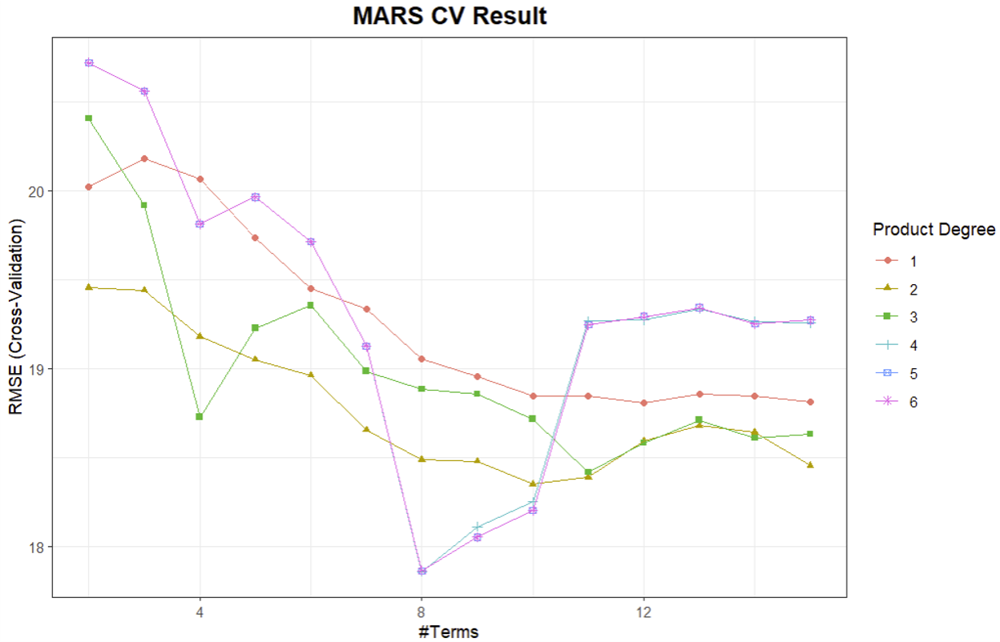

# Exploratory Analysis and Data Visualization

## Variable Types

In this dataset, `age`, `height`, `weight`, `bmi`, `sbp`, `ldl`, and `recovery_time` are continuous variables, while `gender`, `hypertension`, `diabetes`, `vaccine`, `severity`, `race`, and `smoking` are categorical variables.

## Data Visualization

The **boxplot of recovery time by study group and infection severity** finds that in both cases of not severe and severe, the median of recovery time of study A is longer than that of study B, which implies that we need to consider the variable of `study` in our further analysis. In fact, study group can be considered a type of batch effect, so it is worth considering in our model. Specifically, batch effects are systematic non-biological differences between batches in experiments. Moreover, the **boxplot of recovery time by smoking status and gender** reveals a notable trend: across all smoking statuses, females (`gender` = 0) consistently exhibit longer recovery times compared to males. Interestingly, individuals who had never smoked had more outliers on the right side of the boxplot, suggesting a longer recovery time. This counter-intuitive finding suggests that individuals with healthier lifestyles, such as non-smokers, paradoxically require more time to recover from COVID-19.

We then created **scatterplots of six variables against recovery time**. It is evident that most recovery times fall within the range of 0-100 days. However, no clear linear relationship emerges between recovery time and any of the variables.

Moreover, the **correlation analysis** conducted on variables including "height," "weight," and "bmi" suggests a strong correlation among these attributes, which aligns with our common understanding. However, no significant correlations were observed between these attributes and other variables in the dataset.

```{r out.width='60%', fig.align='center', echo=FALSE}

```

```{r out.width='110%', fig.align='center', echo=FALSE}

```

# Model Training

## Lasso

The **model assumptions** for Lasso includes:

-   Linear Relationship: Lasso assumes a linear relationship between the predictors and the response variable. 

-   Sparsity Assumption: Lasso assumes that the true model depends on only a small number of predictors. It can shrink some coefficients to zero and hence perform variable selection.

-   Scaling of Predictors: The predictor variables are centered and standardized before applying lasso regression. This is because the penalty term in lasso regression is applied to the coefficients of the predictor variables, and scaling ensures that this penalty is applied uniformly across all predictors.

The attached graphs display the Root Mean Square Error (RMSE) across different values of the regularization parameter $\lambda$.

```{r out.width='100%', fig.align='center', echo=FALSE}
knitr::include_graphics("lasso_1.png")
```

The cross-validation results with and without 1SE rule show similar trends: the RMSE increases with the increase of regularization parameter $\lambda$.

## Ridge

The **model assumptions** for Lasso includes:

-   Linear Relationship: Similar to ordinary least squares (OLS) regression, ridge regression assumes a linear relationship between the predictors and the response variable.

-   Scaling of Predictors: The predictor variables are centered and standardized before applying ridge regression.

```{r out.width='100%', fig.align='center', echo=FALSE}

```

Similar to lasso model, both cross-validation results with and without 1SE show a similar increasing trend as the regularization parameter increases.

## Elastic Net

The **model assumptions** for Elastic Net includes:

-   Linear Relationship: Similar to other linear models, elastic net assumes a linear relationship between the predictors and the response variable. 

-   Scaling of Predictors: The predictor variables are centered and standardized before applying elastic net.

```{r out.width='110%', fig.align='center', echo=FALSE}
knitr::include_graphics("elasticnet_1.png")
```

According to the plots, the trends of RMSE changing over regularization parameter are similar for cross-validation with and without 1SE rule. The RMSE increases with the increase of regularization parameter for all the mixing percentage except 0.

## PLS

The **model assumptions** for PLS includes:

-   Linear Relationship: PLS assumes a linear relationship between the predictors and the response variable. It aims to find the multidimensional direction in the X space that explains the maximum multidimensional variance direction in the Y space.

-   PLS assumes that the structure of the relationship between variables can be captured through a few latent structures.

```{r out.width='65%', fig.align='center', echo=FALSE}
knitr::include_graphics("PLS.png")
```

The RMSE decreases with the increase of component number, and reaches minimum when component number is 9.

## MARS

The **model assumptions** for MARS includes:

-   Non-linearity and Interaction: MARS does not assume that relationships between the predictors and the response variable are linear or follow a specific functional form. Instead, it adaptively fits piecewise linear regressions that can model complex non-linear relationships and interactions among variables.

-   Distribution of Errors: MARS does not make specific assumptions about the distribution of error terms.\

```{r out.width='65%', fig.align='center', echo=FALSE}

```

A grid search of parameter is conducted in grid 1:6 * 2:15. According to the plot, the RMSE reaches minimum when degree = 4 and terms number = 8.

## GAM

The **model assumptions** for GAM includes:

-   Additivity: The effect of each predictor on the response is additive. The total effect on the response variable is the sum of the effects of each predictor, modeled by its own smooth function.

```{r out.width='80%', fig.align='center', echo=FALSE}
knitr::include_graphics("GAM.png")
```

The graph shows the relationship between the smooth function between predictors and recovery time. Some predictors, such as age, sbp, and ldl, show no significant relationship with recovery time (smooth function = 0). Other predictors, such as BMI, height, and weight, have an additive effect on recovery time through their smooth function.

# Result

## Model Comparation

In **model comparison**, we initially assessed the performance of various models. Among these, the Generalized Additive Model (GAM), Multivariate Adaptive Regression Splines (MARS), Random Forest (rf), and Random Forest Conditional Inference Tree (rf_ctree) demonstrated promising performances. In the following step, we evaluated RMSE and MAE metrics, where MARS and RF exhibited similar performance and emerged as the top two models. However, due to the excessively wide range observed in RF's results, indicating potential instability, we opted for MARS as the final model for its stability and robustness.

```{r out.width='100%', fig.align='center', echo=FALSE}
knitr::include_graphics("finalmodel_2.png")
```

## MARS Model and Intrepertation

\begin{align*}
\hat{Y} &= 3.372 + 5.900 \cdot h(31-\text{bmi}) + 3.651 \cdot h(161.6-\text{height}) \cdot h(\text{bmi}-31) \cdot \text{studyB} \\
&+ 7.639 \cdot h(\text{bmi}-25.3) + (-5.825) \cdot \text{vaccine1} - 514.279 \cdot \text{race2} \cdot h(\text{bmi}-31) \cdot \text{studyB} \\
&+ 8.559 \cdot \text{age} \cdot \text{race2} \cdot h(\text{bmi}-31) \cdot \text{studyB} + 18.363 \cdot \text{severity1} \cdot \text{studyB}
\end{align*}

where $\hat{Y}$ represents the predicted recovery time (in days).

These coefficients represent the combined effect of race, bmi, height, study, vaccine, age, and severity participation on the predicted recovery time. For example, the coefficient $-514.279$ quantifies how being Asian (race group 2), having a BMI deviation from 31 (as determined by the smoothing function), and participating in study B collectively influence the predicted recovery time. Specifically, for individuals meeting these conditions, there is a decrease of 514.279 days in the predicted recovery time compared to White individuals (race group 1) with BMI 31 who participated in the group of study A. 

Using the test dataset to assess the predictive performance of our final model (MARS), we obtained an RMSE of 21.18, an MAE of 13.05, and an R squared of 0.32.

# Conclusion

In conclusion, this study investigated the predictive performance of various models for estimating recovery time from COVID-19 based on demographic and health-related factors. In conclusion, Multivariate Adaptive Regression Splines (MARS) emerged as the optimal choice due to its stable performance and robustness. The coefficients of MARS model shed light on the combined effects of race, BMI, height, study group, vaccine status, age, and severity level on predicted recovery time. Notably, our findings underscore the importance of considering both linear and nonlinear relationships in modeling recovery time, with potential implications for clinical decision-making and resource allocation in managing COVID-19.
