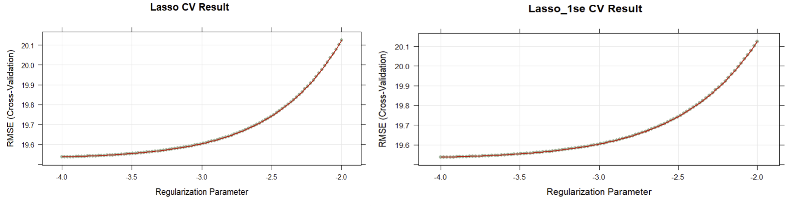

# Exploratory Analysis and Data Visualization

## Variable Types

In this dataset, `age`, `height`, `weight`, `bmi`, `sbp`, `ldl`, and `recovery_time` are continuous variables, while `gender`, `hypertension`, `diabetes`, `vaccine`, `severity`, `race`, and `smoking` are categorical variables.

## Data Visualization

The **boxplot of recovery time by smoking status and gender** reveals a notable trend: across all smoking statuses, females (`gender` = 0) consistently exhibit longer recovery times compared to males. Interestingly, individuals who had never smoked had more outliers on the right side of the boxplot, suggesting a longer recovery time. This counter-intuitive finding suggests that individuals with healthier lifestyles, such as non-smokers, paradoxically require more time to recover from COVID-19.

We then created **scatterplots of six variables against recovery time**. It is evident that most recovery times fall within the range of 0-100 days. However, no clear linear relationship emerges between recovery time and any of the variables.

Moreover, the **correlation analysis** conducted on variables including "height," "weight," and "bmi" suggests a strong positive correlation among these attributes, which aligns with our common understanding. However, no significant correlations were observed between these attributes and other variables in the dataset.

```{r out.width='95%', fig.align='center', echo=FALSE}

```

# Model Training

## Lasso

The **model assumptions** for Lasso includes:

-   Sparsity Assumption: Lasso assumes that the true model depends on only a small number of predictors, implying that the model is sparse. This means it's suited for scenarios where only a few variables significantly impact the response variable.

-   Regularization: By penalizing the magnitude of the coefficients (L1 penalty), Lasso encourages smaller absolute values of coefficients, thus reducing model complexity and the risk of overfitting.

The attached graphs display the Root Mean Square Error (RMSE) across different values of the regularization parameter $\lambda$.

```{r out.width='100%', fig.align='center', echo=FALSE}

```

## Ridge

The **model assumptions** for Lasso includes:

-   

```{r out.width='100%', fig.align='center', echo=FALSE}
knitr::include_graphics("ridge.png")
```

## Elastic Net

The **model assumptions** for Elastic Net includes:

-   Combined Regularization: Elastic Net uses both L1 and L2 regularization, combining Lasso's variable selection capability with Ridge regression's ability to handle highly correlated predictors.

-   Adjusting Regularization Balance: Elastic Net has two regularization parameters, controlling the overall strength of regularization and the weight balance between L1 and L2 terms. This offers more flexible model tuning capability.

```{r out.width='100%', fig.align='center', echo=FALSE}

```

## PLS

The **model assumptions** for PLS includes:

-   Linear Relationship: PLS assumes a linear relationship between the independent variables and the response variable. It aims to find the multidimensional direction in the X space that explains the maximum multidimensional variance direction in the Y space.

-   PLS assumes that the structure of the relationship between X and Y variables can be captured through a few latent structures. This is fundamental to reducing dimension and extracting the most relevant information from X that predicts Y.\

```{r out.width='65%', fig.align='center', echo=FALSE}
knitr::include_graphics("PLS.png")
```

## MARS

The **model assumptions** for MARS includes:

-   Non-linearity and Interaction: MARS does not assume that relationships between the independent variables and the dependent variable are linear or follow a specific functional form. Instead, it adaptively fits piecewise linear regressions that can model complex non-linear relationships and interactions among variables.

-   Distribution of Errors: MARS does not make specific assumptions about the distribution of error terms.\

```{r out.width='65%', fig.align='center', echo=FALSE}
knitr::include_graphics("MARS.png")
```

## GAM

The **model assumptions** for GAM includes:

-   Additivity: The effect of each predictor on the response is additive. The total effect on the response variable is the sum of the effects of each predictor, modeled by its own smooth function.

-   Smoothness of the Predictor Functions: The relationships between the predictors and the response can be adequately modeled using smooth functions. The degree of smoothness is usually determined by the data and is controlled by smoothing parameters, which can be estimated from the data itself.

```{r out.width='80%', fig.align='center', echo=FALSE}

```

# Result

## Model Comparation

In **model comparison**, we initially assessed the performance of various models. Among these, the Generalized Additive Model (GAM), Multivariate Adaptive Regression Splines (MARS), Random Forest (rf), and Random Forest Conditional Inference Tree (rf_ctree) demonstrated promising performances. In the following step, we evaluated RMSE and MAE metrics, where MARS and RF exhibited similar performance and emerged as the top two models. However, due to the excessively wide range observed in RF's results, indicating potential instability, we opted for MARS as the final model for its stability and robustness.

```{r out.width='100%', fig.align='center', echo=FALSE}
knitr::include_graphics("finalmodel_2.png")
```

## MARS Model and Intrepertation

\begin{align*}
\hat{Y} &= 3.372 + 5.900 \cdot h(31-\text{bmi}) + 3.651 \cdot h(161.6-\text{height}) \cdot h(\text{bmi}-31) \cdot \text{studyB} \\
&+ 7.639 \cdot h(\text{bmi}-25.3) + (-5.825) \cdot \text{vaccine1} - 514.279 \cdot \text{race2} \cdot h(\text{bmi}-31) \cdot \text{studyB} \\
&+ 8.559 \cdot \text{age} \cdot \text{race2} \cdot h(\text{bmi}-31) \cdot \text{studyB} + 18.363 \cdot \text{severity1} \cdot \text{studyB}
\end{align*}

where $\hat{Y}$ represents the predicted recovery time (in days).

These coefficients represent the combined effect of race, bmi, height, study, vaccine, age, and severity participation on the predicted recovery time. For example, the coefficient $-514.279$ quantifies how being Asian (race group 2), having a BMI deviation from 31 (as determined by the smoothing function), and participating in study B collectively influence the predicted recovery time. Specifically, for individuals meeting these conditions, there is a decrease of 514.279 days in the predicted recovery time compared to White individuals (race group 1) with BMI 31 who participated in the group of study A.

# Conclusion

In conclusion, this study investigated the predictive performance of various models for estimating recovery time from COVID-19 based on demographic and health-related factors. In conclusion, Multivariate Adaptive Regression Splines (MARS) emerged as the optimal choice due to its stable performance and robustness. The coefficients of MARS model shed light on the combined effects of race, BMI, height, study group, vaccine status, age, and severity level on predicted recovery time. Notably, our findings underscore the importance of considering both linear and nonlinear relationships in modeling recovery time, with potential implications for clinical decision-making and resource allocation in managing COVID-19.
